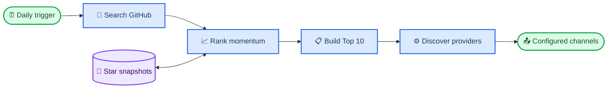

# Agent Radar

_A zero-cost, fork-and-run intelligence feed for the fastest-growing LLM and AI Agent repositories on GitHub._

---

<p align="center">
  <a href="https://github.com/LeonChaoX/awsome-llm-agent-repos/actions/workflows/ci.yml"></a>
  <a href="https://github.com/LeonChaoX/awsome-llm-agent-repos/actions/workflows/daily-radar.yml"></a>
  <a href="LICENSE"></a>
  
  
</p>

<p align="center"><strong>One fork. One secret. Your daily edge in open-source AI.</strong></p>
<p align="center">English · <a href="README.zh-CN.md">简体中文</a></p>

Agent Radar discovers recently created LLM, Agent, MCP, RAG, and multi-agent projects, estimates or measures their seven-day Star growth, ranks the strongest ten, and delivers a polished digest to every channel you configure. No server, database, paid API, or third-party dependency is required.

## 🚀 Start in three minutes

### 1. Fork and enable

[Fork this repository](https://github.com/LeonChaoX/awsome-llm-agent-repos/fork), then open the fork's **Actions** tab and enable workflows. GitHub disables workflows in forked repositories until the owner explicitly enables them.[^1]

### 2. Add one channel secret

Open `Settings → Secrets and variables → Actions → New repository secret`, then add the secret for any channel:

| Channel | Required repository secrets |
| ------- | --------------------------- |
| Feishu | `FEISHU_WEBHOOK_URL` |
| Slack | `SLACK_WEBHOOK_URL` |
| Telegram | `TELEGRAM_BOT_TOKEN`, `TELEGRAM_CHAT_ID` |
| WeCom | `WECOM_WEBHOOK_URL` |
| Discord | `DISCORD_WEBHOOK_URL` |
| Custom service | `GENERIC_WEBHOOK_URL` |

Feishu signature verification is supported through the optional `FEISHU_SIGNING_SECRET`. Configure as many channels as you like; Agent Radar auto-discovers them and sends to all in one run.

> 🔐 **Security:** Webhook URLs and bot tokens are credentials. Store them only as GitHub Actions Secrets—never in workflow files, issues, screenshots, or commits. Secrets are not copied when another user forks this repository.[^2]

### 3. Run the radar

Open `Actions → Agent Radar Daily → Run workflow`. A successful run delivers the first digest and creates a dedicated `data` branch for Star snapshots. The schedule then runs daily at `02:00 UTC`, which is `10:00 Asia/Shanghai`.

See the [channel guide](docs/CHANNELS.md) for provider setup and [deployment](docs/DEPLOYMENT.md) for the complete walkthrough.

## 📡 What arrives every day

Each digest contains ten repositories with:

- Direct repository links and concise descriptions
- Current Star count and seven-day growth
- Primary language and ranking confidence
- A clear marker while the seven-day snapshot window is warming up

The same report can be delivered to multiple destinations in parallel. A versioned generic webhook connects email, Notion, Zapier, n8n, a private API, or any channel that is not built in yet.

## 📈 How ranking works

GitHub Search provides current repository metadata but not historical Star deltas.[^3] Agent Radar therefore maintains a compact daily snapshot on the `data` branch.

| Phase | Growth value | Label |
| ----- | ------------ | ----- |
| First run | Project-age Star velocity normalized to seven days | Estimated |
| Days 2–6 | Observed velocity normalized to seven days | Estimated |
| Day 7 onward | Current Stars minus the latest snapshot at least seven days old | Measured |

Growth is the dominant ranking signal. Topic relevance breaks close ties and filters unrelated projects. Candidates must be recently created, public, non-fork, non-archived, and relevant to LLM or Agent development.

> 📌 **Honest metrics:** Cold-start values are explicitly marked with `~`. Agent Radar never presents lifetime Stars as measured weekly growth.

## 🏗️ Architecture

The collector, snapshot store, ranker, and notification channels are deliberately separated. Adding a channel does not change discovery or ranking behavior.



The runtime uses only the Python standard library. See [architecture](docs/ARCHITECTURE.md) for data flow, failure isolation, state format, and extension points.

## ⚙️ Configuration

Optional repository variables live under `Settings → Secrets and variables → Actions → Variables`:

| Variable | Default | Allowed | Purpose |
| -------- | ------: | ------- | ------- |
| `REPOSITORY_LIMIT` | `10` | `1`–`20` | Repositories per digest |
| `LOOKBACK_DAYS` | `180` | Positive integer | Maximum project age in candidate search |

To change delivery time, edit the cron expression in `.github/workflows/daily-radar.yml`. GitHub notes that scheduled workflows can be delayed during high-load periods, especially near the start of an hour.[^4]

## 🧩 Add a channel

Notification providers implement one small interface: load configuration, build a safe payload, and send it. Start with [adding a channel](docs/ADDING_A_CHANNEL.md); the CI matrix tests Python `3.10` through `3.13` on every pull request.

```text
scripts/channels/
├── base.py       # Contract, HTTP safety, shared formatting
├── feishu.py     # Interactive card + optional signature
├── slack.py      # Block Kit webhook payload
├── telegram.py   # Bot API HTML message
├── wecom.py      # Enterprise WeChat markdown
├── discord.py    # Ten rich embeds
└── generic.py    # Versioned JSON event
```

## 🛠️ Local development

Python `3.10+` is sufficient; there is nothing to install.

```bash
git clone https://github.com/LeonChaoX/awsome-llm-agent-repos.git
cd awsome-llm-agent-repos
python -m unittest discover -s tests -v
```

Preview every channel without sending a request:

```bash
python scripts/collect_repos.py --state state/stars.json --output output/repos.json
python scripts/notify.py output/repos.json --dry-run
```

## 🤝 Community

- Read [CONTRIBUTING.md](CONTRIBUTING.md) before opening a pull request
- Use the issue templates for bugs, channels, and feature proposals
- Follow the [Code of Conduct](CODE_OF_CONDUCT.md)
- Report credential exposure or vulnerabilities through [SECURITY.md](SECURITY.md)

If Agent Radar earns a place in your daily workflow, a Star helps other builders discover it. Channel providers, ranking improvements, translations, and documentation fixes are all welcome.

## 📄 License

Released under the [MIT License](LICENSE). You may use, modify, and distribute Agent Radar in personal and commercial projects.

## 🔗 References

[^1]: GitHub. "Workflows in forked repositories." _GitHub Docs_. https://docs.github.com/en/actions/reference/workflows-and-actions/events-that-trigger-workflows#workflows-in-forked-repositories

[^2]: GitHub. "Secrets reference." _GitHub Docs_. https://docs.github.com/en/actions/reference/security/secrets

[^3]: GitHub. "Search repositories." _GitHub REST API Docs_. https://docs.github.com/en/rest/search/search#search-repositories

[^4]: GitHub. "Troubleshooting workflows." _GitHub Docs_. https://docs.github.com/en/actions/how-tos/troubleshoot-workflows#delayed-scheduled-workflows
