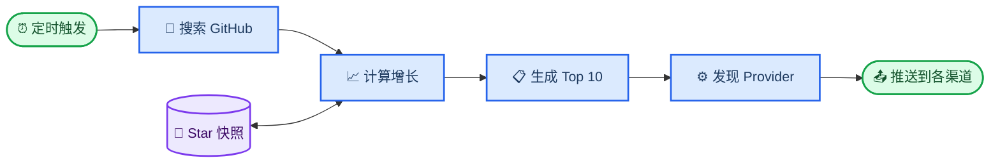

# Agent Radar

_零成本、Fork 即用的 GitHub LLM 与 AI Agent 热门项目情报雷达。_

---

<p align="center">
  <a href="https://github.com/LeonChaoX/awsome-llm-agent-repos/actions/workflows/ci.yml"></a>
  <a href="https://github.com/LeonChaoX/awsome-llm-agent-repos/actions/workflows/daily-radar.yml"></a>
  <a href="LICENSE"></a>
  
</p>

<p align="center"><strong>Fork 一次，配置一个 Secret，每天掌握开源 AI 新趋势。</strong></p>
<p align="center"><a href="README.md">English</a> · 简体中文</p>

Agent Radar 每天发现近期创建的 LLM、Agent、MCP、RAG 与多智能体项目，估算或计算它们的 7 日 Star 增量，选出增长最快的 10 个仓库，并推送到你配置的所有消息渠道。无需服务器、数据库、付费 API 或第三方 Python 依赖。

## 🚀 三分钟开始使用

### 1. Fork 并启用 Actions

[Fork 本仓库](https://github.com/LeonChaoX/awsome-llm-agent-repos/fork)，打开你仓库中的 **Actions** 页面并启用工作流。GitHub 默认不会在 Fork 后自动运行工作流，需要仓库所有者主动启用。[^1]

### 2. 添加任意渠道 Secret

进入 `Settings → Secrets and variables → Actions → New repository secret`：

| 渠道 | 必需的 Repository Secrets |
| ---- | -------------------------- |
| 飞书 | `FEISHU_WEBHOOK_URL` |
| Slack | `SLACK_WEBHOOK_URL` |
| Telegram | `TELEGRAM_BOT_TOKEN`、`TELEGRAM_CHAT_ID` |
| 企业微信 | `WECOM_WEBHOOK_URL` |
| Discord | `DISCORD_WEBHOOK_URL` |
| 自定义服务 | `GENERIC_WEBHOOK_URL` |

飞书开启签名校验后，再添加可选的 `FEISHU_SIGNING_SECRET`。你可以同时配置多个渠道，工作流会自动发现并逐一推送。

> 🔐 **安全提示：** Webhook 与 Bot Token 都属于敏感凭证，只能保存在 GitHub Actions Secrets 中，禁止写进代码、Issue、截图或提交记录。Fork 不会复制原仓库的 Secrets。[^2]

### 3. 手动验证

进入 `Actions → Agent Radar Daily → Run workflow`。成功运行后会立即推送第一期榜单，并创建专用 `data` 分支保存 Star 快照。之后每天北京时间 11:07 自动运行。

各平台机器人的创建步骤见[渠道配置指南](docs/CHANNELS.md)，完整部署和排错流程见[部署指南](docs/DEPLOYMENT.md)。

## 📡 每天会收到什么

- 10 个近期快速增长的 LLM 与 Agent 仓库
- 仓库链接、简介、主要语言和当前 Star
- 真实或明确标注为估算值的 7 日 Star 增长
- 适配每个聊天平台的卡片、区块或富文本消息

同一份榜单可以同时推送到多个平台。通用 Webhook 会发送带版本号的 JSON 事件，可继续连接邮件、Notion、Zapier、n8n 或内部服务。

## 📈 排名是否真实

GitHub Search API 只提供当前仓库数据，不提供历史 Star 增量。[^3] Agent Radar 因此每天在 `data` 分支保存一份轻量快照：

| 阶段 | 增长值算法 | 展示方式 |
| ---- | ---------- | -------- |
| 首次运行 | 项目创建以来的 Star 速度归一化到 7 天 | 估算值 |
| 第 2–6 天 | 已观测增长速度归一化到 7 天 | 估算值 |
| 第 7 天起 | 当前 Star 减去至少 7 天前的快照 | 真实值 |

增长速度是主要排序指标，主题相关性用于过滤误匹配并打破接近的排名。候选仓库必须是近期创建、公开、非 Fork、未归档且与 LLM 或 Agent 开发相关的项目。

> 📌 **不制造虚假指标：** 冷启动期间的增长会使用 `~` 标记，不会把累计 Star 冒充成本周增长。

## 🏗️ 工作原理



采集、排名、快照和通知 Provider 相互独立，新增渠道不会改变榜单算法。详细设计见[架构文档](docs/ARCHITECTURE.md)。

## ⚙️ 可选配置

在 `Settings → Secrets and variables → Actions → Variables` 中添加：

| Variable | 默认值 | 作用 |
| -------- | -----: | ---- |
| `REPOSITORY_LIMIT` | `10` | 每期仓库数量，可设置为 `1`–`20` |
| `LOOKBACK_DAYS` | `180` | 候选仓库的最大项目年龄 |

如需修改推送时间，请编辑 `.github/workflows/daily-radar.yml` 中的 cron。GitHub 官方说明定时工作流在高负载时可能延迟，整点附近尤其常见。[^4]

## 🧩 参与贡献

项目只使用 Python 标准库，Python `3.10+` 即可开发：

```bash
git clone https://github.com/LeonChaoX/awsome-llm-agent-repos.git
cd awsome-llm-agent-repos
python -m unittest discover -s tests -v
```

离线预览所有渠道，不会发送网络请求：

```bash
python scripts/collect_repos.py --state state/stars.json --output output/repos.json
python scripts/notify.py output/repos.json --dry-run
```

新增平台请阅读[新增渠道指南](docs/ADDING_A_CHANNEL.md)，提交 PR 前请阅读[贡献指南](CONTRIBUTING.md)。如果项目对你有帮助，欢迎 Star、分享或贡献新的 Provider。

## 📄 开源许可

项目采用 [MIT License](LICENSE)，可以自由用于个人及商业项目。

## 🔗 参考资料

[^1]: GitHub. "Workflows in forked repositories." _GitHub Docs_. https://docs.github.com/en/actions/reference/workflows-and-actions/events-that-trigger-workflows#workflows-in-forked-repositories

[^2]: GitHub. "Secrets reference." _GitHub Docs_. https://docs.github.com/en/actions/reference/security/secrets

[^3]: GitHub. "Search repositories." _GitHub REST API Docs_. https://docs.github.com/en/rest/search/search#search-repositories

[^4]: GitHub. "Troubleshooting workflows." _GitHub Docs_. https://docs.github.com/en/actions/how-tos/troubleshoot-workflows#delayed-scheduled-workflows
