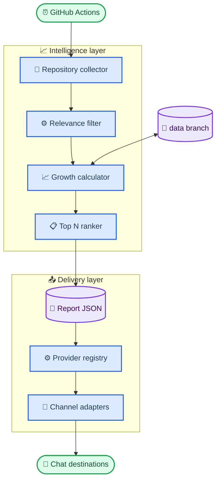

# Agent Radar architecture

_Design boundaries, data contracts, ranking lifecycle, and security model._

---

## 📋 Design goals

Agent Radar optimizes for four properties:

- **Forkability:** no infrastructure outside a GitHub repository
- **Honesty:** estimates and measured growth are never conflated
- **Extensibility:** delivery channels do not affect collection or ranking
- **Credential safety:** secrets remain in the runner environment and never enter reports or snapshots

## 🏗️ Components



| Component | File | Responsibility |
| --------- | ---- | -------------- |
| Collector and ranker | `scripts/collect_repos.py` | Search, relevance, growth, selection, state update |
| Provider registry | `scripts/channels/__init__.py` | Stable channel-name to implementation mapping |
| Notification runner | `scripts/notify.py` | Configuration discovery, fan-out, aggregate errors |
| HTTP safety | `scripts/channels/base.py` | Timeout, credential-safe failures, shared formatting |
| Channel adapters | `scripts/channels/*.py` | Platform payload and response validation |
| Orchestration | `.github/workflows/daily-radar.yml` | Schedule, token scope, state persistence, artifact |

## 📈 Ranking lifecycle

### Candidate discovery

The collector issues several authenticated GitHub repository searches covering `llm`, `large language model`, `ai agent`, `agentic`, `multi-agent`, `mcp`, and `rag`. Every query adds these constraints:

```text
created:>=<lookback date> archived:false fork:false
```

Results are deduplicated by lowercase `owner/name`, then filtered against repository name, description, and Topics. Search is intentionally broad; local relevance scoring removes low-signal matches.

### Growth calculation

For each candidate, the calculator chooses the strongest available evidence:

1. A snapshot at least seven days old → exact non-negative delta
2. A shorter observed history → extrapolated seven-day delta
3. No history → project-age Star velocity normalized to seven days

The report stores `growth_exact` and `observed_days`, allowing every provider to mark estimates consistently.

### Ranking score

The primary signal is logarithmic seven-day growth. A small relevance score breaks close ties without allowing keyword density to overpower project momentum:

```text
score = log(1 + weekly_growth) × 100 + relevance
```

## 💾 Data contracts

### Snapshot state

`data:stars.json` is append-oriented operational state with a rolling retention window:

```json
{
  "version": 1,
  "snapshots": [
    {
      "date": "2026-07-21",
      "stars": {
        "owner/repository": 1234
      }
    }
  ]
}
```

### Report artifact

`output/repos.json` is immutable for one run and contains no credentials. It is safe to upload as a workflow artifact or send through the generic webhook.

Provider code must treat the report as read-only. Schema changes require tests and a documented migration when they affect the generic webhook contract.

## 🛡️ Security boundaries

| Boundary | Control |
| -------- | ------- |
| GitHub API | Ephemeral repository-scoped `GITHUB_TOKEN` |
| Provider credentials | Repository Secrets mapped directly to step environment |
| Logs | Provider names only; credential-bearing URLs omitted from errors |
| Pull requests from forks | CI runs read-only and does not reference delivery Secrets |
| Snapshot branch | Contains only public repository Star counts |
| Generic webhook | Receives only the public report contract |

The daily workflow needs `contents: write` only to maintain `data`. The separate CI workflow uses `contents: read` and never invokes a network delivery path.

## 🧯 Failure behavior

- Search failure stops ranking and prevents an empty digest
- A partially configured provider stops notification with an explicit missing Secret name
- Delivery attempts continue after one provider fails
- Aggregated provider failures fail the step after all configured channels are attempted
- Snapshot persistence runs even when delivery fails, preserving measurement continuity
- HTTP exceptions omit webhook URLs and bot tokens

This design prefers visible partial failure over silent loss while ensuring one unavailable chat platform does not block the others.
